# GhostMesh

<p align="center">
  
</p>

<p align="center">
  <strong>Decentralized stealth messaging for web and Android.</strong><br />
  End-to-end encrypted conversations over an opportunistic peer-to-peer mesh.
</p>

<p align="center">
  <a href="LICENSE"></a>
  
  
  
  
</p>

<p align="center">
  <a href="#features">Features</a> ·
  <a href="#quick-start">Quick start</a> ·
  <a href="#how-mesh-routing-works">How it works</a> ·
  <a href="#android">Android</a> ·
  <a href="#security-notes">Security</a>
</p>

> [!WARNING]
> GhostMesh is an experimental reference architecture, **not an independently audited product**. Do not rely on it for life-safety communications or other high-risk use without a thorough security review.

## At a glance

GhostMesh combines end-to-end encrypted messaging with peer discovery, multi-hop forwarding, expiring messages, and a live network HUD. The **browser build uses a simulated swarm** for development and demos; the Android project includes BLE and Wi-Fi Direct transport bridges.

- **Keep conversations private:** Ed25519 identities and signatures, X25519 session setup, and AES-256-GCM message encryption.
- **Route around unavailable peers:** discover nearby nodes, select next hops, relay packets, and track acknowledgements.
- **Leave less behind:** optional message TTLs purge expired content from app state and the encrypted local vault.
- **See the network:** an interactive 3D globe, diagnostics, and a security panel make activity visible.

## Quick start

```bash
npm install
npm run dev        # http://localhost:5173 — simulated peer swarm
npm test           # Vitest: crypto, security bot, and mesh routing
npm run lint       # Oxlint
npm run build      # Type-check and create the production bundle in dist/
```

On the lock screen, enter any callsign and a passphrase of at least six characters. In the browser demo, generated peer identities exercise the handshake, signing, routing, acknowledgements, and threat-detection paths without requiring nearby devices.

## Features

| Capability | What it does | Implementation |
|---|---|---|
| **End-to-end encryption** | Ed25519 identity and packet signatures; X25519 → HKDF-SHA256 → **AES-256-GCM** sessions; RSA-4096-OAEP key wrapping. The worker owns private key material. | [`src/crypto/`](src/crypto/) |
| **Self-destructing chat** | Per-message TTL countdowns; expired messages are purged from React state, Zustand, and the encrypted IndexedDB vault. TTL is carried inside ciphertext so the receiver follows the same schedule. | [`useSelfDestruct.ts`](src/hooks/useSelfDestruct.ts) · [`VaultStorage.ts`](src/services/VaultStorage.ts) |
| **Biometric unlock** | Fingerprint/face authentication on Android, passphrase fallback on the web, and automatic re-lock when the app moves to the background. | [`Biometric.ts`](src/native/Biometric.ts) · [`LockScreen.tsx`](src/components/LockScreen.tsx) · [`useAppLifecycle.ts`](src/hooks/useAppLifecycle.ts) |
| **Hybrid peer mesh** | A common transport interface for BLE, Wi-Fi Direct, and the browser simulator. Discovery, handshakes, next-hop routing, relaying, loop/TTL guards, and ACK tracking live in the mesh manager. | [`src/mesh/`](src/mesh/) · [`src/mesh/transports/`](src/mesh/transports/) |
| **Live 3D network map** | Wireframe globe, peer markers, expanding discovery pings, route arcs, and click-to-chat. | [`MeshMap.tsx`](src/components/MeshMap.tsx) |
| **Security monitor** | Sliding-window detection for invalid signatures, replays, handshake brute force, floods, GCM tampering, TTL abuse, and key substitution. Includes rate-limits/blocks, a redacted event log, notifications, and live red-team controls. | [`SecurityBot.ts`](src/services/SecurityBot.ts) · [`SecurityPanel.tsx`](src/components/SecurityPanel.tsx) |
| **Network diagnostics** | 1 Hz samples of RX/TX bytes, loss, RTT, average hops, and peer count, shown as live SVG graphs. | [`AnalyticsEngine.ts`](src/services/AnalyticsEngine.ts) · [`DiagnosticsDashboard.tsx`](src/components/DiagnosticsDashboard.tsx) |
| **Chunked file transfer** | Files are split into 32 KiB chunks and encrypted with a per-file key. AAD binds each chunk to `(transferId, index)`; chunks can be striped across up to four relay paths. The file key is delivered over E2EE. | [`MeshManager.ts`](src/mesh/MeshManager.ts) |
| **AMOLED / Neon HUD** | Switch between pure-black, low-power AMOLED styling and the holographic neon HUD. | [`src/styles/index.css`](src/styles/index.css) |

## How mesh routing works

The illustration below shows the idea: the sender encrypts the message, reachable peers forward ciphertext toward the recipient, and only the recipient decrypts it. A relay can help deliver a packet without reading its contents. Android transport links are BLE and Wi-Fi Direct; the web demo simulates peers.

<p align="center">
  
</p>

The mesh manager handles discovery, handshakes, route selection, relay limits, and acknowledgements. Each packet carries routing metadata so peers can forward it; content is authenticated and encrypted independently of those mutable routing fields.

## Project layout

```text
src/
├── components/   MeshMap · SelfDestructChat · HudShell · LockScreen · SecurityPanel
│                 DiagnosticsDashboard · NodeList · Sparkline
├── crypto/       E2EECore · E2EEWorker · E2EEClient · encoding
├── mesh/         MeshManager · Transport · transports/{Simulated,Ble,WifiDirect}
├── services/     MeshService · SecurityBot · AnalyticsEngine · VaultStorage
├── native/       Biometric · Notifications · WifiDirectPlugin · platform
├── store/        useGhostStore (Zustand)
├── hooks/        useSelfDestruct · useTheme · useAppLifecycle
├── styles/       index.css (Tailwind v4 theme)
└── types/        shared domain types
android-src/      Kotlin plugins (Wi-Fi Direct, BLE peripheral) and manifest additions
docs/             Android bridging guide and README illustrations
```

## Android

See **[docs/CAPACITOR_ANDROID.md](docs/CAPACITOR_ANDROID.md)** for the full setup guide, including Capacitor project creation, Kotlin plugin wiring, permissions, GATT UUIDs, the Wi-Fi Direct socket protocol, foreground relay service, and hardening flags.

```bash
npx cap add android   # once, to create the native project
npm run cap:sync      # build + sync native assets/plugins
npm run cap:open      # open Android Studio
```

Native radio behavior requires a correctly configured Android project, permissions, and compatible devices. The web simulator does not exercise physical BLE or Wi-Fi Direct radios.

## Web deployment (Vercel)

GhostMesh is a static Vite SPA. Deploy the generated `dist/` directory, not the source tree.

1. Import the repository in Vercel and use the Vite preset (`npm run build`, output directory `dist`).
2. Serve over **HTTPS**. WebCrypto (`crypto.subtle`) and the E2EE worker require a secure context.

If the screen goes blank after **Generate keys & enter**, check the browser console: rendering errors are caught by the `SIGNAL LOST` boundary panel. If **BOOTING MESH…** remains frozen, confirm the deployed `assets/E2EEWorker-*.js` file is present and served without a 404, CSP, or MIME-type error, then reload.

## Security notes

- Private keys stay inside the E2EE worker. **PANIC** wipes keys, sessions, and the vault.
- Packet signatures cover `id|type|from|to|timestamp|iv|payload`. Mutable routing fields (`ttl`, `hopCount`, `path`) are excluded so relays can forward packets without re-signing them; they cannot alter the authenticated content.
- Ciphertext AAD binds each message to `(id, from, to)`, so spliced packets fail GCM authentication.
- Coordinates are fuzzed before advertisement; only coarse location is used.
- The web build's swarm is simulated. It is useful for exercising application flows, not for validating real-world radio behavior or security.
- This is a reference architecture, not a substitute for an independent cryptographic and operational security audit.

## License

GPL-3.0 — see [LICENSE](LICENSE).
